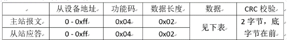
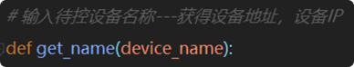
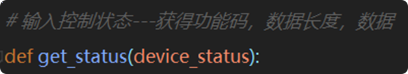

# 版本管理

| 版本代码 |     更改内容 |           主要作者           | 完成时间      | 备注 |
|:--------|-------------:|:----------------------------:|:-------------|:-----|
| v1      | 完成整体内容 | 许耿瑞、康源清、栗浩鹏 | 2020年5月20日 |      |


# 前言
编写目的：本篇文档的目的在于让读者了解OWELL产品最新的技术架构和业务逻辑。

# 项目简介  
作为现代化的智能健康办公环境解决方案，OWELL系统监测建筑在各有关方面的性能以及人员行为持续涉及的各个方面，并在整个建筑生命周期中为健康建筑的运营和维护提供支持，实现可测量的健康和可控制的环境，满足WELL认证的要求。  


# 文章结构


# 一、整体框架和分工

### 1.项目逻辑架构
> 编辑：许耿瑞


### 2.物联网开发子结构
> 编辑：康源清


#### 智能硬件

- 检测装置

  蓝居空气盒子

  此设备为空气质量检测装置，其中检测参数为：

  

  易微联安防

  此设备包括两个子设备：红外检测，门窗磁检测。红外检测的检测参数：是否有人移动。门窗磁检测的检测参数：两个磁铁是否闭合。


- 控制设备

  智能开关

  此设备为液晶触摸开关面板。根据所接待控设备不同，可实现不同的设备控制。此设备为易微联平台控制，即OWELL平台服务器发送待控设备和控制指令给易微联服务器后，设备接收到易微联服务器的指令后改变状态。

  智能窗帘

  此设备为可控电机，控制方式有手动控制，遥控器控制，OWELL平台远程控制。

#### 底层通信协议

- WIFI

  WIFI通信方式可以使待控设备不受距离限制，可远程操作。智能硬件中自带WIFI模块的设备包括：易微联安防设备，易微联智能开关，蓝居空气盒子。

  此通信方式为：将设备进行网络配置，将其连接至同一网关，后发送厂家提供的通信指令按照指定的网络传输方式发送给厂家服务器。

  以易微联设备登录功能为例：

  厂家提供协议内容如下

  

  Python代码实现

  


- RS485

  RS485通信方式为有线通信，可达到快速可靠的效果。智能硬件中自带RS485模块的设备包括：创明窗帘电机。另外未接通的松下新风系统也是使用RS485通信方式。

  此通信方式为：通过串口线发送厂家提供的通信指令给设备的控制芯片，控制芯片解析指令后更改设备状态。

  以创明窗帘电机修改电机地址为例：

    厂家提供协议内容如下

  

  Python代码实现

  

- RS485和WIFI转换

    由于RS485有线通信有距离限制，所以只具有RS485模块的设备需要连接一个RS485转WIFI设备。

    此项目采用的是汉枫EW11转换设备。此设备有独立的IP地址和端口号。在汉枫I.O.T Service平台设置相关的参数后，可进行控制。相关参数设置需要符合设备RS485协议要求。WIFI参数设置为内网的路由器参数。

     

    经过串口转换设备后

    Python代码如下

  

#### 网络传输方式

- http

  易微联设备和蓝居设备均使用http传输方式

  Python代码实现

  

- socket

  创明设备使用socket传输方式

  Python代码实现

  


### 3.服务器后端开发子结构
> 编辑：许耿瑞


#### 路由注册
现有的路由注册内容包括：
- 前端页面跳转
- 测试页面跳转
- 采集轮询链接
- 控制触发链接
- 报警轮询和触发链接

owell2\routes\web.php

```
// phpinfo测试页面
Route::get('/biaogetest', 'PagessController@biaogetest')->name('biaogetest');

//主页
Route::get('/', 'PagessController@index')->name('index');

// 采集 2020.03.25
Route::get('/lanju_inside_n', 'CollectController@datathismoment')->name('lanju_inside_n');

// 控制 2020.04.03
Route::get('/light_controller/{id}', 'DevicesController@light')->name('light');

// 报警 2020.04.16 Route::get('/alarms/index',
'AlarmsController@index')->name('alarms');
```

路由注册的链接访问后会跳转到指定控制方法的指定函数中工作，如  
`AlarmsController@index` 即 AlarmsController 控制器的 index 函数方法

#### 控制器方法
本段先介绍控制器的分类，并归纳总结出控制器的函数功能。
##### 分类
 现用的控制器方法逻辑分类为：
- 页面跳转控制器 PagessController
- 采集逻辑控制器 CollectController
- 控制逻辑控制器 DevicesController
- 报警逻辑控制器 AlarmsController

##### 采集逻辑控制器 CollectController
- 采集实时数据

```
$py_data = ppython2("lanju_inside::Lanju_inside");

$iandm = ppython2("GET_STATUS::main");
```

- 读取数据库
```
$history_hour_origin = DB::table('lanju_insides')->latest('SERVER_TIME')
    ->where('SERVER_TIME', '>', date('Y-m-d H:i:s',strtotime('-7 hour')))
    ->where('SERVER_TIME', '<=', date('Y-m-d H:i:s',strtotime('now')))
    ->limit(420)->get()->toArray();
```

- 数据整理
```
$history_hour = $this->array_change($history_hour_origin);
```

- 输出实时坐标
```
$axis7days = [date('m-d',strtotime('-6 day')),
    date('m-d',strtotime('-5 day')),
    date('m-d',strtotime('-4 day')),
    date('m-d',strtotime('-3 day')),
    date('m-d',strtotime('-2 day')),
    date('m-d',strtotime('-1 day')),
    date('m-d',strtotime('now'))];
```

##### 控制逻辑控制器 DevicesController
- 获取设备最新状态
```
$device_status_array = ppython2("get_device_status::go", $device_name);
```
- 控制设备
```
ppython2("light_controller::go",$device_name, $device_status_now);
```

##### 子页面跳转控制器 PagessController

- 获取报警信息
- 
```
return view('phpinfo.biaogetest');
```


#### 模型方法
模型是数据库对应的某个实体类，定义好后可用于前后端数据交互。
现有模型：
- 蓝居室内空气盒子 Lanjuinside
- 报警信息模型 Alarm

功能：
- 定义属性
```
protected $fillable = [
    'device_id', 'alarm_categories', 'alarm_data', 'alarm_description', 'alarm_clean'];
```

- 模型关联
```
return $this->belongsTo(LanjuInside::class);
```

#### 数据迁移和填充
现有数据迁移如下：
- 创造迁移 lanju_inside
- 创造迁移 conditions
- 创造迁移 alarms
- 填充迁移 conditions
- 随机数据填充 LanjuinsideFactory

功能：
- 创建迁移表

owell2\database\factories\create_lanju_insides_table.php

```
  $table->bigIncrements('id');
  $table->bigInteger('device_id')->comment('设备ID');
  $table->string('alarm_categories')->comment('报警分类');
  $table->float('alarm_data', 8, 2)->comment('报警数据');
  $table->text('alarm_description')->nullable()->comment('报警信息描述');
  $table->boolean('alarm_clean')->comment('是否解决');
```

- 填充数据表

owell2\database\factories\seed_conditions_table.php

```
$conditions = [
    [
        'condition_categories'      => 'TEMP',
        'condition_1'               => 20,
        'condition_1_description'   => '请调高空调温度，并注意保暖舒适。',
        'condition_2'               => 30,
        'condition_2_description'   => '请调低空调温度，注意解暑。',
    ],
    DB::table('conditions')->insert($conditions);
```

- 随机快速填充数据

填充工厂：owell2\database\factories\LanjuInsideFactory.php
```
    return [
        'DeviceID' => '62011711',
        'TEMP' => round(randomFloat(25, 29),1),
        'PM25' => randomFloat(15, 19),
        'CO2' => randomFloat(700, 800),
        'NOISE' => randomFloat(20, 40),
        'HUMI' => randomFloat(50, 80),
        'VOC' => randomFloat(0.1, 0.3),
        'CH2O' => randomFloat(0.2, 0.5),
        'LUX' => randomFloat(300, 900),
        'SERVER_TIME' => $date_time3,
    ];
```
填充函数：owell2\database\seeds\LanjuInsidesSeeder.php
```
        for ($i=0; $i<=10; $i++) {
            $lanju_inside = factory(LanjuInside::class)
                ->times(1000)
                ->make();

            LanjuInside::insert($lanju_inside->toArray());
```
注册：owell2\database\seeds\DatabaseSeeder.php
```
$this->call(LanjuInsidesSeeder::class);
```

#### 事件监听

目前现有的事件和对应的监听

owell2/app/Providers/EventServiceProvider.php
```
App\Events\AlarmWorking' => [ 'App\Lisenter\alram_1',
```

- 事件触发

owell2/app/Events/AlarmWorking.php

```
event(new AlarmWorking());
```

- 事件监听

owell2/app/Lisenter/alram_1.php

```
    public function handle(AlarmWorking $event)
    {
        //读取最新数据
        $maxid = DB::table('lanju_insides')->max('id');
        $data_now = DB::table('lanju_insides')->where('id', '=', $maxid)->first();

        //判断是否有问题，将有问题的数据列转为报警数据
        $alarmarray = isSafe($data_now);

        // 报警数据重复性检查，重复的更新，没有的才插入。
        foreach ($alarmarray as $a) {
         Alarm::updateOrCreate(
                ['device_id' => $a['device_id'], 'alarm_categories' => $a['alarm_categories'], 'alarm_clean' => False],
                ['alarm_data' => $a['alarm_data'], 'alarm_description' => $a['alarm_description'],]
            );
        }
    }
```

#### 辅助函数

所在位置：owell2/app/Helpers

目前用到的辅助函数包括
- randomFloat() 随机浮点数
- ppython() 用于laravel与python交互，与物联网设备通信
- isSafe() 用于判断实时数据是否触发报警条件
- array_change() 用于对多条数据处理处理计算平均值


#### 调试工作
测试按钮是后端用于数据采集和控制需要制作的一个页面：


owell2\resources\views\phpinfo\biaogetest.blade.php

```
    <div class="sysw">
        <button
            class="alarm btn-primary center-block btn-sm ">
            <p style="font-size:5rem;">报警测试</p>
        </button>
    </div>
```
```
<script>
    let alarm = document.querySelector('.alarm');
    alarm.addEventListener('click', function() {

        $.ajax({
            url:'/alarms/index',
            type:'get',
            success: function (data) {
                // data 返回两个参数，一个数字data[0]，一个对象数组data[1]：
                console.log(data[0]);  // 输出一个数字，一共有多少个报警事件
                console.log(data[1]);  // 列出所有报警事件
                console.log(data[1][0]);   // 列出其中第一个报警事件
                console.log(data[1][0]['alarm_data']); // 打印第一个报警事件中的的报警数值
                console.log("-------------");
            },
            error : function() {
                alert("异常！");
            }
        })
    })
</script>    
```
配合浏览器中`开发者工具控制台`进行调试，即可确保前端工程师可以用同样的方式完成数据调用。
当然如果用的顺手，也可以使用[*laravel-tinker-shell*](https://learnku.com/articles/7338/understand-laravel-tinker-shell)进行调试。


### 4.前端开发子结构
> 编辑：栗浩鹏

 

##### 任务描述
 简而言之，前端就是界面的实现和交互，决定你看到的界面究竟是什么样子，决定每一个点击，划过等事件。 在本项目中，还包括echart图表的样式编辑以及superApi的交互。

##### 界面和分区


#### 主要文档结构
```
    ...
    public                      #包含js，css文件，图片等
    resources                   #页面入口文件,html主框架
    ...

```
    在这些文档中，我们主要编辑resources和public文件夹，其中，resources文件夹主要用作html文件的编写， 而public文件包括js，css图片等
##### 页面文件  
```
resources
  js
  lang
  sass                                           #.css源文件，因为npm run 命令有错误，所以直接写在了public里
  airs
  common
  views
      dataview
        show.blade.php                            # 子页面文件，主页，默认路由，输入owell.test跳转到这一页面，后续由于子页面采取了同一页面隐   
                                                    藏显示div的方式，仅保留了这一页面
        test.blade.php                            # 子页面文件，测试页面，链接为 owell.test/test  
      layouts
        _footer.blade.php                         #页面文件底部
        _header.blade.php                         #页面文件头部，导航栏等
        _header.blade.php.back1
        app.blade.php                             #页面文件内容部分
      phpinfo                                    
        biaogetest.blade.php                       #其他测试页面
        datav.blade.php
        show.blade.php.back
```

##### 页面文件逻辑
当跳转到index页面时，默认跳转到app.blade页面 。这是一个默认视图页面。在该页面中进行网页的默认呈现效果 ，该页面包含了一些局部视图的引入。包括头（导航栏部分）、尾（联系方式等）和内容部分（图表，三维等）
```
    <!DOCTYPE html>
    <html>

    <head>
      <meta charset="utf-8">                                                                      #上方部分，主要引入一些css，依赖和声明类js
      <meta http-equiv="X-UA-Compatible" content="IE=edge,chrome=1">
      <meta name="viewport" content="width=device-width, initial-scale=1">

      <!-- CSRF Token -->
      <meta name="csrf-token" content="{{ csrf_token() }}">

      <!-- Js -->
      <script type="text/javascript" src="js/rely/jquery.js"></script>

      <script type="text/javascript" src="js/rely/echarts.min.js"></script>
      <script type="text/javascript" src="js/rely/echarts-liquidfill.min.js"></script>
      

    
      <script language="Javascript" src="js/rely/uiduck.js"></script>
      <script language="Javascript" src="js/rely/json2.js"></script>
      <!-- Styles -->                                                     
      <link href="{{ mix('css/app.css') }}" rel="stylesheet">

      <link rel="stylesheet" href="./css/ai.css">                                                 
      <link href="css/uiduck.css" type="text/css" rel="stylesheet">
      <link href="css/table.css" type="text/css" rel="stylesheet">
      <link rel="stylesheet" type="text/css" href="css/checkboxaaa.css">
      <link rel="stylesheet" type="text/css" href="css/checkboxbbb.css">
    
        <script type="text/javascript" src="js/51js/let51.js"></script>
    <script type="text/javascript" src="js/let.js"></script>

      @yield('styles')     

    </head>

    <body >


    <div class="container-fulid" >

    

    <!-----HEADER END-----> 
    <!--用来解决视频右键菜单，用于视频上面的遮罩层 START-->

        @include('layouts._header')                                                      ##导航栏部分

        

      
        @yield('content')                                                                ##内容部分
      

        @include('layouts._footer')                                                      ##联系方式等，放在页面尾部的内容
    </div>


      <!-- Scripts -->                                                                   ##下方js部分，主要引入一些需要执行的函数，以及依赖性强的函数
      <script type="text/javascript" src="js/database.js"></script>
      <script type="text/javascript" src="js/51js/superAPI-2.6.0-owell.min.js"></script>    ##51VR superapi文件 
      <script src="js/jtoggler.js" type="text/javascript"></script>
      <script src="{{ mix('js/app.js') }}"></script>
      <script src="http://www.jq22.com/jquery/jquery-1.10.2.js"></script>
      <script type="text/javascript" src="js/51js/51control.js"></script>
      <script type="text/javascript" src="js/51js/51vr.js"></script>
    <script  type="text/javascript" src="js/control.js"></script>
      <script type="module" src="js/js.js"></script>
      <!-- <script type="text/javascript" src="js/51vr.js"></script> -->
    
    

      <script src="js/ai.js"></script>


    <script type="module" src="js/charts/kongqi.js"></script>

      <!-- <script src="js/bg.js" type="text/javascript"></script> -->
      <script type="module"   src="js/charts/show.js"></script>                            ##echart图表部分的js，分页面，这部分用来module来模块化处理，方便将其引入其他js文件执行。echart的图表在外部数据更新后需要重新执行才会刷新。
      <script type="module"  src="js/charts/guangqiang.js"></script>     
    
      <script type="module"  src="js/charts/shushi.js"></script>
      <script  type="module"  src="js/charts/shuizhi.js"></script>
      <script  type="module"  src="js/charts/yingyang.js"></script>
      <script type="module"  src="js/charts/jianshen.js"></script>
      <script  type="module"  src="js/charts/kangyi.js"></script>
      <script  type="module"  src="js/charts/renyuan.js"></script>
    
    

      @yield('scripts')

    </body>

    </html>
```

##### js文件功能
```
      - 51js                                                                         ##存放51VR 相关的js文件
        -  51control.js                                                                   ##存放51vr相关的控制文件，包括场景的切换，导航条，以及按钮条等
        -  51vr.js                                                                        ##51VR 支持文件，包含poi点的点击，划过，授权地址等
        -  let51.js                                                                       ##POI点的声明   场景声明等
        -  superAPI-2.6.0-owell.min.js
        -  superAPI.min.js
      - charts                                                                       #图表文件js存放
      - data_json
      - layer
      - old                                                                          #之前用过的js
      - rely                                                                         #依赖文件，jq等
        -  ai.js                                                                         #导航条
        -  app.js                      
        -  bg.js                                                                         #一个星空背景，未用
        -  control.js                                                                    #全局的点击事件
        -  database.js                                                                   #与数据库的交互，从数据库获取数据
        -  js.js                                                                         #全局事件，初始化，包括导航栏，时间器
        -  jtoggler.js
        -  let.js                                                                        #声明文件
        -  list.json
        -  switchery.js         
```

##### CSS 文件功能
```
      ai.css                                                                       #导航条，单独部分
      app.css                                                                      #主css文件，大多数样式都在这里定义
      checkboxaaa.css                                                              #checkbox  选择按钮
      checkboxbbb.css
      comon0.css
      style.css
      switchery.css
      table.css
      uiduck.css
```

#### 51VR简介
51VR致力于数字孪生的建设，在本项目中，主要用作东田大厦三维模型的渲染和交互。除导航栏和两侧图标区外，中间的大楼和模型部分是51VR


#### 51VR开发文档 （OWELL项目）
>superapi最新开发文档                     https://api.51hitech.com/jsapi/index-270.html  
东田owell项目开发文档 
https://api.51hitech.com/jsapi/index-260.html  
云渲染部署手册   https://cloud.51hitech.com/docs/setupmanual.html  
坐标点测量工具  http://api.51hitech.com/jsapi/tools.html?guid=5e55e70b6cb9c20750243aed&role=guest&id=123456&serve=http://192.168.17.222:8889  
在线测试工具 http://api.51hitech.com/jsapi/cloud.html?category=editor&guid=5e55e70b6cb9c20750243aed&role=guest&id=123456&serve=http://192.168.17.222:8889

##### 51VR  引入和应用
主要参考上文链接  东田OWELL 项目开发文档，现将东田项目的一些特定参数做一些总结
>51VR 实时渲染平台地址  https://192.168.17.222:8890/Any
  
##### 账号密码：　

```
管理员账号： systemAdmin   密码： 问浩鹏      

来访账号 ： guest  　 密码 ：123456    
```


##### 授权参数
```
      let _url = 'http://192.168.17.222:8889/';
      let renderPath = 'Renderers/Any/5e55e70b6cb9c20750243aed/';      #字段由实时渲染地址中项目网址可以得到
      let staticUserName = 'guest';
      let staticPwd = '123456';
```

##### 基本的POI点

只写了一个基本事件，其他请参考上文开发文档
```js
let51.js           #51相关声明文件
        airpoiData_kongtiao = {                            #定义一个poi点
            "object_id" : "air_kongtiao",   //POI点的ID
            "object_name": "空调系统", //POI提示文本
            "object_floor": "3",//用于建筑楼层, 1 一层 (非必填)
            "object_type": "airConditioner",//图标的类别 (图标的样式, 需双方沟通约定)//此项目中. 约定为：①cameraLine; ②buildingLine; ③portLine;
            "coord_type": "1",  //(0: 经纬度gis, 1: cad坐标                                                                              )
            "object_coord" : "300077,-137743",//POI点的坐标(坐标类型需与该POI点的object_type相同)
            "coord_z": '0',//单位米, 坐标为GIS时决定POI图标高度; CAD时无效, 不用填
            "showtitle":"true",//true 显示提示文本(默认), false 不显示提示文本
            "showtitlerange":"30, 500",//此POI点显示title的镜头距离范围(单位米, 范围最小、最大距离; 在此范围内显示, 超出范围隐藏title, 注: showtitle属性为true时生效)
            "monitormouseoverlap":"ture"//此POI是否允许监听鼠标划过事件
            }
51control.js      #51控制文件
        cloudRender.SuperAPI('AddPOI', airpoiData_kongtiao);          增加一个poi点
```


##### 其他相关文件


#### 业务逻辑的实现方式

##### 页面跳转
由于51VR云渲染加载较慢，如果采用Laravel推荐的跳转方式，会重新加载51VR，使得浏览体验编的很差，所以调整了网页的跳转方式，通过div块级元素的显示和隐藏来达到切换子页面的木的。
```
    #show.blade.php          #页面文件

        @extends('layouts.app')

        @section('title')

        @section('content')


        {{-- 全局css all  除了头尾以外的部分 上图内容部分，除了导航条的其他部分--}}
        <div class="all" style="padding-right: 0px; padding-left:0px; margin-left:0px; margin-right:0px;z-index: 10;">


               {{--boxno   用来加载51vr   是一个没有大小的元素，51VR通过获取这个palyer  id来执行，遮罩屏幕执行--}}
               <div class="boxno">
                   <div  id="player" style="padding-right: 0px; padding-left:0px; margin-left:0px; margin-right:0px;z-index: 10;"></div>
               </div>

          

                      {{--maincontain 块级元素，决定每一个子页面  通过maincontain元素的显示和隐藏来实现页面切换--}}
                     <div class="maincontain maincontain_zhuye"> </div>    
                     <div class="maincontain maincontain_kongqi"> </div>
                     <div class="maincontain maincontain_guangqiang"> </div>
                 

        </div>


        @stop

  
    js.js                   #js文件，方法


                       $(maincontain_zhuye).css("display","block");  //首页 显示
                    
                       $(maincontain_zhuye).css("display","none");   //首页 隐藏
```

##### echart图表 
>echart官网地址 https://www.echartsjs.com/zh/index.html

 echart图表js文件放在putblic/js/charts目录中，每个文件对应每一个子页面，以首页文件show.js为例子，图中黄色方框圈起来的块级元素e111  -   e888就是需哟啊echart图表填充的部分
 

##### 填充方法
```
    function e111() {
            
        // 基于准备好的dom，初始化echarts实例
        var myChart = echarts.init(document.getElementById('e111'));


        /*             中间这部分复制echart官网中实例部分即可，做一定的调整使其表达出想要呈现的效果               */


             // 使用刚指定的配置项和数据显示图表。
        myChart.setOption(option);
        window.addEventListener("resize",function(){
            myChart.resize();
        });
    }
```

#### 数据声明、采集、使用流程

###### 数据声明

全局的数据声明统一写在public/js/let.js里，方便数据的查阅，修改。在这里给每一个echart要用的变量设定了一个初始值，在读不出数据库的时候显示该值
 ```js   
      /*

      这个是专门放变量的js
      文件存放组织结构为：全局、空气、光强、水、、、、等。
      每个结构下面分为控制模块和poi点。

      注意命名规范，缩进正确。

      2020/01/16 许耿瑞
      */


      // kqdatabase=[]
      // --------------------------全局  主页数据----------------------------------- // 
      mb="";   //浏览器，适配不同浏览器时用的，后来修改为分辨率  用了
      kqdatabase=[[]];
      weekkqdatabase=[[]];
      xtimeday=[[]];

      ziyemiandata =["zhuye","kongqi","shuizhi","guangqiang", "shushi", "yingyang","jianshen", "kangyi", "renyuan"]


      //首 页 数 据

      timeweek=["3/15","3/16","3/17","3,18","3/19","3/20","3/21"]   //s一周的时间坐标
      timeday=["8:00","9:00","10:00","11:00","12:00","13:00","14:00"]   // 一天的时间坐标，倒推七个小时


      kqdata=[25,50,12,20,15,800]     //空气数据  温度，湿度，甲醛 voc pm2.5 co2
      waterdata=[3,3,2,0.4] // 浑浊度，PH,电导率，余氯
      voice=[30,50]      //室内 室外  噪声 
      jsdata1=[60,50,70,80,50,90,80]  //健身人数
      jsdata2=[40,50,30,20,50,10,20]   //总人数-健身人数
      jsdata3=50  //实时健身人数


      ////舒适  数据定义

      
      var shushidata = [
          {
              name: '舒适',
              value: voice[0]       /////噪声
          },{
              name: '舒适',
              value: 300                    //////空气质量  未定义？？？
          },{
              name: '舒适',
              value: kqdata[1]                  //////湿度
          },{
              name: '舒适',
              value: kqdata[0]                 //////温度
          }]

          ////消毒记录
      quyu=['办公室','茶水间','会议室','走廊','洗手间','洽谈室','电梯间']
      xiaodudata=['已消毒','已消毒','待消毒','已消毒','待消毒','已消毒','已消毒']
      xiaodutime=['3.01     18:00','2.29     18:00' ,'2.28     18:00','2.27     18:00','2.26     18:00','2.25     18:00','2.24     18:00']

      ////人员占地密度指标
      renyuandata=[10,20,30,40,50,61]   ////办公区人数，会议区人数，来访人数，开窗数，开门数，门窗状态


      // --------------------------空气子页面     单独用历史数据----------------------------------- //
      ///kqdata    同首页
      airco2data=[300,500,400,600,1000,900,1050]  ///co2  7天
      airvocdata=[500,700,600,550,400,500,600]    ///voc  7d
      airtemdata=[25,22,23,25,23,24,25]          //tem   7d
      airhumdata=[30,40,35,50,60,55,65]        //hum 7d
      airhumdataday=[30,40,35,50,60,55,65,50]      //hum 7h

      airpm25data=[10,5,20,8,25,15,3]          //pm25  7d
      airchohdata=[10, 20,15 , 10, 20];     //choh  按区域

```

###### 从数据库读取数据

数据库的读取写在database.js里，调用ajax请求，获取数据，并且将其赋值给let.js中的定义
```js
    function getkqdata_h() {     
      
                                            #获取空气数据，小时
                $.ajax({
                url:'/lanju_inside_h',
                type:'get',
                success: function (data) {
                console.log("day.................................");
                        //是否可以使用php写出来
                console.log(data);         

                kqdatabase=data;                                       #返回数据data，是一个二重数组

                kqdata=[kqdatabase[0][0],kqdatabase[0][4],kqdatabase[0][6],kqdatabase[0][5],kqdatabase[0][1],kqdatabase[0][2]]//空气数据  温度，湿度，甲醛 voc pm2.5 co2
                  #赋值给定义的kqdata


                },
                error : function() {
                    alert("异常！");
                }
                }
                )

    }
```
函数执行控制台数据
```js
    (7) [Array(8), Array(8), Array(8), Array(8), Array(8), Array(8), Array(8)]
    0: (8) [27.1, 17.3, 751, 29.9, 62.7, 0.2, 0.4, 570.8]
    1: (8) [26.8, 17, 748.1, 30.7, 64.3, 0.2, 0.3, 554.4]
    2: (8) [26.9, 16.8, 750.5, 30.3, 65, 0.2, 0.4, 595.1]
    3: (8) [27.2, 16.9, 750.1, 29.6, 65.2, 0.2, 0.4, 599.9]
    4: (8) [27.2, 17.1, 750.4, 30.5, 65.7, 0.2, 0.4, 566.2]
    5: (8) [27.2, 17.3, 749.3, 30.8, 64.7, 0.2, 0.4, 573.3]
    6: (8) [27.2, 17.3, 751, 30.5, 64.4, 0.2, 0.4, 585.9]
    length: 7
    __proto__: Array(0)
```

###### 在echart中使用数据

      var data=kqdata;  

###### echart图表数据更新
写在函数内部的数据可以实时更新，但如果数组在外部改变，例如从ajax获取之后，会发现数据改变了，但echart图表中的数据并未更新，这时，需要重新执行echart函数有来让图表数据变化。为此，在本项目中，我们做出了几种更新机制。
1.一定时间后执行
```js

 setTimeout(function(){
  echartinit0();
},3000);                                  #由于ajax的调取和初始加载需要一段时间，所以在页面加载完毕三秒后，第一次执行echart，确保数据正确更新
    
setInterval(function(){
echartinit0();

},60000);                                 #每分钟自动更新一次图表
    
    
        

    
    
    })

    
    
    function echartinit0(){               #这是首页的一组echart ，一起作为一个初始化函数声明
   
        e111();
        e222();
        e333();
         e444();
        // e555();
      e666();
        e777();
        e888();
        e999();
    }
```
2.在点击导航栏时更新，以首页为例
```js 
show.js  #首页echart文件
      export{echartinit0};                     #在show.js  （首页echart文件）最后，将初始化函数作为一个模块输出


js.js    #全局函数文件
     import {echartinit0} from "./charts/show.js";           #在js.js中，将echartinit0函数作为模块导入进来


     // 子页面切换函数，只需要补充let.js中的ziyemiandata数组即可
     function ziyemiandataswitch (data) {

    ////子页面切换函数，在切换时刷新图表
      var echartinit=[echartinit0,echartinit1,echartinit2,echartinit3,echartinit4,echartinit5,echartinit6,echartinit7,echartinit8]

      var zymdata = data;
      var str1 = '.maincontain_';

      for (let i = 0 ; i < zymdata.length; i++) {

          let data123 = zymdata[i];
          document.querySelector('.nav-lin' + i).addEventListener('click', function() {     #为每一个导航页添加点击函数，当发生点击事件时
        
              echartinit[i]();                                                              #刷新当前页面echart图表

              $(str1 + zymdata[lastdata]).css("display","none");                            #隐藏掉前一个页面
              if (lastdata==1){                                           
                  $(str1 + zymdata[lastdata]+"2").css("display","none");    
              }
        
          $('.nav-lin'+lastdata).css("background-color","#ba1c1c00");                       #将前一个页面对应的导航条变为黑色
              $(str1 + data123).css("display","block");                                     #显示当前页面对应的内容
    if(i!=0)
          {
          
            $('.nav-lin'+i).css("background-color","#158fd587");                            #如果不是首页，则将当前子页面对应的导航条高亮

          }
      
              lastdata=i;


          })
      }
  }
    
```

###### 点击事件的实现
点击事件主要通过jq，给某一个div的class或者id添加点击事件来实现。
```js
    let tiaozhuan_show = document.querySelector('.nav-lin0');                       #nav-lin0 是首页导航栏的class
        tiaozhuan_show.addEventListener('click', function() {                       #添加一个点击事件
        
            cloudRender.SuperAPI('RemoveAllPOI');                         
            cloudRender.SuperAPI('specialChannel', objData0); 
        })
```


### 5.产品设计和管理


# 二、产品主要功能和业务逻辑流程梳理

### 1.蓝居数据采集流程


##### (1)物联网端业务逻辑
> 编辑：康源清

蓝居的水质监测仪和空气检测仪均是检测数据设备，此代码作用为从蓝居平台获取检测的实时数据。

###### 环境检测设置
在设备上电后，需要进行环境检测设置。具体步骤见文件_蓝居环境检测设置说明。

1. 电脑断网
2. 连接蓝居WIFI，WIFI名称密码在设备背后
3. 登录管理站点，输入管理密码
4. 设备网络设置
5. 网络连接成功后查看检测数据
6. 在pycharm平台上编写代码


###### 代码说明
语言：Python
输入参数：8位设备编码，水质监测仪：59370014，空气检测仪：62011711


owell2/app/Helpers/Python2/lanju_inside.py

```
import requests
import time
import json


def Lanju_inside():
    # 请求地址
    url = "http://122.112.234.240:9007/monitor/devices/real/62011711/all/0"

    # 发送get请求
    r = requests.get(url)

    # 处理时间
    localtime_Y = time.strftime("%Y", time.localtime())

    data = {
        "DeviceID": r.json()['data'][0]['DeviceID'],
        "TEMP": r.json()['data'][0]['TEMP'],
        "PM25": r.json()['data'][0]['PM25'],
        "CO2": r.json()['data'][0]['CO2'],
        "NOISE": r.json()['data'][0]['NOISE'],
        "HUMI": r.json()['data'][0]['HUMI'],
        "VOC": r.json()['data'][0]['VOC'],
        "CH2O": r.json()['data'][0]['CH2O'],
        "LUX": r.json()['data'][0]['LUX'],
        # "SERVER_TIME" : r.json()['data'][0]['CreateTime'],
    }
    # 获取返回的json数据
    print(data)
    return data
```

###### 调试调用
owell2/app/Http/Controllers/CollectController.php
```
 $py_data = ppython2("lanju_inside::Lanju_inside");
```

##### (2)服务器端业务逻辑
> 编辑：许耿瑞

服务器后端开发需求描述：  
定义实时采集、读取7小时内的平均数据、读取7天的平均数据、并输出最新时间数组用于前端调用。

###### 路由创建
owell2/routes/web.php
```
// 采集 2020.03.25 Route::get('/lanju_inside_n',
'CollectController@datathismoment')->name('lanju_inside_n');

Route::get('/lanju_inside_h',
'CollectController@data7hour')->name('lanju_inside_h');

Route::get('/lanju_inside_d',
'CollectController@data7day')->name('lanju_inside_d');

Route::get('/axis', 'CollectController@axis')->name('axis');
```
###### 控制器方法
```
    //实时数据采集
    public function datathismoment() {
        ...
    }

    // 7小时历史数据
    public function data7hour () {
        ...
    }

    //7日历史数据
    public function  data7day () {
       ...
    }

    //
    public function axis () {
        ...
    }
```
###### 模型方法
owell2/app/Models/LanjuInside.php

定义属性：
```
 protected $fillable = [
        'DeviceID', 'TEMP', 'PM25','CO2', 'NOISE', 'HUMI',
        'VOC', 'CH2O', 'LUX','SERVER_TIME'];
```

###### 数据迁移和字段修饰

owell2/database/migrations/2020_03_25_034215_create_lanju_insides_table.php

```
    public function up()
    {
        Schema::create('lanju_insides', function (Blueprint $table) {
            $table->bigIncrements('id');
            $table->bigInteger('DeviceID');
            $table->float('TEMP', 8, 2);
            ...
            $table->timestamp('SERVER_TIME',0);

        });
    }
```

###### 数据填充

由于不可能打开传感器7X24小时去获取数据进行调试，所以需要一些数据填充工具来将数据表按一定要求填充，
由此而生了关于数据填充的功能需求

填充工厂：owell2\database\factories\LanjuInsideFactory.php
```
    return [
        'DeviceID' => '62011711',
        'TEMP' => round(randomFloat(25, 29),1),
        ...
        'SERVER_TIME' => $date_time3,
    ];
```
填充函数：owell2\database\seeds\LanjuInsidesSeeder.php
```
        for ($i=0; $i<=10; $i++) {
            $lanju_inside = factory(LanjuInside::class)
                ->times(1000)
                ->make();

            LanjuInside::insert($lanju_inside->toArray());
```
填充注册：owell2\database\seeds\DatabaseSeeder.php
```
$this->call(LanjuInsidesSeeder::class);
```

一切完成之后运行
```
php artisan migrate:refresh --seed
```
打开`HEIDISQL数据可视化管理工具`即可看到填充了10000条数据。

###### 采集业务调试
owell2/resources/views/phpinfo/biaogetest.blade.php

ajax
```
    let qitian = document.querySelector('.qitian');
    qitian.addEventListener('click', function() {
        $.ajax({
            url:'/lanju_inside_d',
            type:'get',
            success: function (data) {
                console.log("-------------");
                console.log(data);
            },
            error : function() {
                alert("异常！");
            }
        })
    })
```
按钮css
```
    <div class="sysw">
        <button
            class="qitian btn-primary center-block btn-sm ">
            <p style="font-size:5rem;">七天</p>
        </button>
    </div>
```

调试方式：

- 访问 `owell2.test/biaogetest/` ,点击 `七天`
  按钮，在开发者工具中的控制台观察返回值。

- 直接访问`owell2.test/lanju_insides_d`，可以得到更多的信息。

###### 后续优化思路

- 增加蓝居水质检测的相关业务
- 增加蓝居室外空气检测的相关业务

##### (3)前端业务逻辑
> 编辑：栗浩鹏


### 2.易位联数据控制流程


##### (1)物联网端业务逻辑
> 编辑：康源清

###### 设备说明

主要硬件设备为开关控制面板，可实现功能根据连接的具体产品不同而具体分析，但所有功能均以开关面板的开关状态表示。

###### 基本流程

1. 登录，认证帐号获取认证token，通过认证后才能获取访问服务的权限。2.
2. 设备信息，获取帐号下添加的所有设备。设备控制时需要提供相关设备数据以及用户数据。
3. 访问分配服务，获取连接信息。
4. 建立长连接，通过第三步获取的长连接信息，建立连接。
5. 握手，通过第一步获取的认证信息(at即accesstoken)，进行握手，握手成功后，表示认证通过，允许进行设备控制。
6. 控制设备，通过第二步获取的设备信息，发送代码指令进行设备控制。

###### 程序说明


-  Control文件夹
owell2/app/Helpers/Python2/control

控制文件包主要包括，获取设备参数文件get_device_params.py，sha256加密算法文件sha256.py，登录授权文件part1post.py，刷新认证文件part15.py，请求设备列表文件part2get.py，请求分配服务文件part3post.py。
 此文件夹的作用主要是进行登录鉴权和获取所需数据，主要获取的参数有Access Token(AT)值，deviceid值，url值

- constant.py

存放不变的参数值，包括AT值，RT值，所有设备id。
其中常量表内创建了device_vs_control 字典，此作用可便于之后的调用。

- get_device_status.py

可获取设备的当前状态。按照开发文档要求，发送http请求，返回所需参数

- light_controller.py

主函数输入参数为需控制的设备名和控制状态。  
此文件是控制设备的关键，即websocket连接，握手，通信。  
以下是WebSocketApp的必须的构造函数，在on_open函数中写建立Websocket握手时调用的函数，即在可调用函数中写控制设备名称和控制状态。

owell2/app/Helpers/Python2/light_controller.py

```
    def on_open(ws):
        wdata = json.dumps(woshou, sort_keys=False)
        ws.send(wdata)

        # 读取
        def run(control_params):
            for i in range(1):
                time.sleep(1)
                jdata = json.dumps(control_params, sort_keys=False)
                ws.send(jdata)
            time.sleep(1)
            ws.close()
            print("thread terminating...")

        thread.start_new_thread(
            run(controlling_params(controlling_name=device_name, controlling_status=device_status)), ()
        )

    websocket.enableTrace(False)
    ws = websocket.WebSocketApp(url=url, on_message=on_message, on_error=on_error, on_close=on_close)
    ws.on_open = on_open
    ws.run_forever()
```


###### ppython控制
owell2/app/Http/Controllers/DevicesController.php
```
ppython2("light_controller::go",$device_name, $device_status_now);
```


##### (2)服务器端业务逻辑
> 编辑：许耿瑞

###### 路由注册
owell2/routes/web.php
```
// 控制 2020.04.03
Route::get('/light_controller/{id}', 'DevicesController@light')->name('light');
```

这里用到了路由模型绑定传参的一个概念，{id}可以输入整数0/1/2/3...
就会将这个参数传入控制器方法中，这个设计主要是为了匹配多个开关多种灯的开断控制。

###### 控制器方法
```
 public function light($id) {
        switch ($id) {
            case 0:
                // 定义当id为1时为指定的灯光或设备
                $device_name = "light_IC4_2";
                break;
            case 1:...
            case 2:...
            case 3:...
            // 更多
        }

        // 获取设备最新状态
        $device_status_array = ppython2("get_device_status::go", $device_name);
        $device_status_now = $device_status_array['status'];

        //简单切换开关状态,待后续功能补充和优化
        if ($device_status_now == "on")
        {
            $device_status_now = "off";
        } else {
            $device_status_now = "on";
        }

        // 根据按钮进行灯光指令输出
        $a = ppython2("light_controller::go",$device_name, $device_status_now);
        return $a;
    }

```

###### 采集业务调试

1. 在开发环境中运行
   ```
   python3 owell2/app/Helpers/Python2/php_python.py
   ```
2. 打开 `owell2.test/biaogetest` ，点击各种灯按钮测试。


###### 后续优化思路

- 提高开关等响应时间
- 对控制进行权限策略和认证管理


##### (3)前端业务逻辑
> 编辑：栗浩鹏

### 3.易位联安防数据采集流程


##### (1)物联网端业务逻辑
> 编辑：康源清


易微联完整版接口文档：https://coolkit-technologies.github.io/apiDocs/#/zh-cmn/接口中心

######  检测设备


- 红外感应：此设备在OWELL系统中用于检测人员在位情况，当检测为有人即表示员工在位，当检测为无人则表示员工不在工位。
- 门窗磁感应：此设备在OWELL系统中用于检测人员是否站立办公情况，当检测为门窗磁铁闭合表示办公桌未升起即人员是坐姿办公，当检测为门窗磁开启则表示办公桌升起即人员是站立办公。

######  基本流程
1. 登录，认证帐号获取认证token，通过认证后才能获取访问服务的权限。
2. 设备信息，获取帐号下待控制的设备ID.
3. 获取数据。根据接口文档里提供的参数说明，编写代码。

###### 程序说明

控制设备程序包括以下文件：
- GET_STATUS.py

调用magnet.py和sensor.py。将获取的检测数据放入字典中，便于后端放入数据库。

- magnet.py

获取红外感应设备的检测数据，其中后台所需数据为’motion’指标，即是否有物体移动。’motion’为’1’表示有物体移动，’motion’为’0’表示无物体移动。具体请求参数遵循易微联开发文档，其中“deviceid”从constant.py中获得。

- sensor.py


获取门窗磁设备的检测数据，其中后台所需数据为’lock’指标，即是否锁住。’lock’为’1’表示桌面开启，即办公桌上升，’lock’为’0’表示桌面闭合，即办公桌下降。程序与magnet.py基本相同，只需把deviceid换成sensor设备。

- constant.py

常量表，用于存放值不变的参数。在magnet.py和sensor.py中需要调用constant文件中存放的at值，即在登录步骤中获得AccessToken值。

主要代码为GET_STATUS.py
owell2/app/Helpers/Python2/GET_STATUS.py
```
from control import sensor
from control import magnet

def main():
    dict1 = dict(sensor.main(), **magnet.main())
    return dict1
    
if __name__ == "__main__":
    main()
```


##### (2)服务器端业务逻辑
> 编辑：许耿瑞

易位联的数据采集和蓝居的数据采集在服务器后端的开发需求上大同小异。

###### 路由注册

owell2/routes/web.php
```
Route::get('/iandm', 'CollectController@iandm')->name('Infrared and magnetism');
```

###### 控制器函数

```
    public function  iandm() {
        $iandm = ppython2("GET_STATUS::main");
        return $iandm;
    }
```

###### 调试

- 访问 `owell2.test/biaogetest/` ,点击
  `红磁感应`，得到最新的红外和门磁的状态。 在开发者工具中的控制台观察返回值。

- 直接访问`owell2.test/iandm`，可以得到更多的信息。

###### 后续优化思路

- 完成“红外和门磁”的模型定义，以及生成数据迁移和填充等工作。

##### (3)前端业务逻辑
> 编辑：栗浩鹏

### 4.创明窗帘控制流程


##### (1)物联网端业务逻辑
> 编辑：康源清


###### 硬件连接

创明电机为220V供电，另外再接汉枫RS485转WIFI串口线，汉枫串口线为12V供电，具体汉枫串口线设置见汉枫说明文件。


###### 软件控制


###### 代码说明

文件 constant.py
常量表，电机各功能对应的指令数据
例：电机控制。数据除2字节的CRC校验码以外，数据包括地址，功能码，数据长度，和数据。注意的是，只有电机控制指令，数据长度为2，其余指令长度均为1。当数据长度为1时，data_2的值为空。




Control.py ：此文件主要包括五个函数。

主函数：输入需控制的电机名，控制状态。输入格式必须符合Constant内已定义的值。
获取设备名称：每一个电机有不同的地址码，并且匹配的WIFI接口设备有不同的IP地址。所有设备的地址码和IP地址已写入Constant.py文件，通过次函数的参数调用可获取指定设备的地址码和IP地址。


获取设备名称：每一个电机有不同的地址码，并且匹配的WIFI接口设备有不同的IP地址。所有设备的地址码和IP地址已写入Constant.py文件，通过次函数的参数调用可获取指定设备的地址码和IP地址。


获取指令数据：每一种控制状态的功能码，数据长度，数据的组合不同。根据创明电机协议已将电机的所有功能对应的指令组合放入Constant.py文件，通过此函数的参数调用获得功能状态对应的指令组合。


获得CRC校验码：需校验数据包括get_name函数获得的地址码+get_status函数获得功能码+数据长度+数据


传输指令数据：需要两个参数才能进行通信，一是传输对象，二是传输指令。通信方式采用socket通信。传输对象通过调用get_name函数获得对应设备的设备IP地址。传输指令为所有需要进行CRC校验的数据和校验返回的数据：地址码+功能码+数据长度+数据+CRC校验码。将所有数据整合成一串指令，每个十六进制数以空格分开。


###### ppython控制
owell2/app/Helpers/Python2/curtain_controller.py
```
if __name__=="__main__":
    controlling_param(device_name="motor_0", device_status="on")
```


##### (2)服务器端业务逻辑
>编辑： 许耿瑞

###### 路由注册
```
Route::get('/curtain_controller/{id}','DevicesController@curtain')->name('curtain');
```

###### 控制器函数

```
    public function curtain($id) {
        $request = ppython2("curtain_controller::controlling_param", "motor_0", "off");
        return $request;
    }
```

###### 调试

- 访问 `owell2.test/biaogetest/` ,点击 `窗帘控制`，观察窗帘电机的状态。
  在开发者工具中的控制台观察返回值。
- 直接访问owell2.test/curtain_controller/0,观察反馈信息和窗帘点击状态。

###### 后续优化思路
窗帘电机的控制还没有完全开发成熟，
- 传参的多样性需要整理，比如多态窗帘的多种上调、下降、返回状态等需要梳理。
- 后续需要建立数据表进行窗帘控制的记录。
- 控制和展示上的需求不成熟，需要与物联网端开发、前端开发进行多次沟通协调，灵活调整开发方案。

##### (3)前端业务逻辑
> 编辑：栗浩鹏


### 5.报警触发业务逻辑
> 编辑：许耿瑞

这个业务需要获取采集的实时数据，并进行判断报警触发条件，如果达到报警阈值就会返回报警数据和报警描述。

###### 事件触发

owell2/app/Http/Controllers/CollectController.php
```
event(new AlarmWorking());
```

###### 事件监听

owell2/app/Lisenter/alram_1.php
```
public function handle(AlarmWorking $event)
    {
        //读取最新数据
        $maxid = DB::table('lanju_insides')->max('id');
        $data_now = DB::table('lanju_insides')->where('id', '=', $maxid)->first();

        //判断是否有问题，将有问题的数据列转为报警数据
        $alarmarray = isSafe($data_now);

        // 报警数据重复性检查，重复的更新，没有的才插入。
        foreach ($alarmarray as $a) {
         Alarm::updateOrCreate(
                ['device_id' => $a['device_id'], 'alarm_categories' => $a['alarm_categories'], 'alarm_clean' => False],
                ['alarm_data' => $a['alarm_data'], 'alarm_description' => $a['alarm_description'],]
            );
        }
    }
```

###### 辅助函数

owell2/app/Helpers/helpers.php

```
function isSafe($dataLast) {
    $conditions = Condition::all();
    $db = $dataLast;
    $confirm = [];
    foreach ($conditions  as $condition ) {
        switch ($condition -> condition_categories) {
            case 'TEMP':
                break;
            case 'HUMI':
                break;
        }
    }
    return $confirm;
}
```

###### 报警条件定义
创建数据表：

owell2/database/migrations/2020_04_17_075608_create_conditions_table.php
```
    public function up()
    {
        Schema::create('conditions', function (Blueprint $table) {
            $table->bigIncrements('id');
            $table->string('condition_categories')->index()->comment('触发条件分类');
            $table->float('condition_1', 8, 2)->nullable()->comment('触发条件1');
            $table->text('condition_1_description')->nullable()->comment('触发条件1的描述信息');
            $table->float('condition_2', 8, 2)->nullable()->comment('触发条件2');
            $table->text('condition_2_description')->nullable()->comment('触发条件2的描述信息');
            // 可后续根据新增需求补充更多的触发条件
        });
    }
```
填充数据表：

owell2/database/migrations/2020_04_17_084032_seed_conditions_table.php
```
    public function up()
    {
        $conditions = [
            [
                'condition_categories'      => 'TEMP',
                'condition_1'               => 20,
                'condition_1_description'   => '请调高空调温度，并注意保暖舒适。',
                'condition_2'               => 30,
                'condition_2_description'   => '请调低空调温度，注意解暑。',
            ],
            [
                'condition_categories'      => 'HUMI',
                'condition_1'               => 40,
                'condition_1_description'   => '请注意保湿，打开加湿器，预防静电。',
                'condition_2'               => 80,
                'condition_2_description'   => '当前环境湿度大，请注意抽湿工作。',
            ],
        ];

        DB::table('conditions')->insert($conditions);
    }

```

###### 模型和数据迁移定义

owell2/app/Models/Alarm.php
```
    protected $fillable = [
        'device_id', 'alarm_categories', 'alarm_data', 'alarm_description', 'alarm_clean'
    ];

    public function lanjuinside()
    {
        return $this->belongsTo(LanjuInside::class);
    }
```
owell2/database/migrations/2020_04_16_022619_create_alarms_table.php
```
    public function up()
    {
        Schema::create('alarms', function (Blueprint $table) {
            $table->bigIncrements('id');
            $table->bigInteger('device_id')->comment('设备ID');
            $table->string('alarm_categories')->comment('报警分类');
            $table->float('alarm_data', 8, 2)->comment('报警数据');
            $table->text('alarm_description')->nullable()->comment('报警信息描述');
            $table->boolean('alarm_clean')->comment('是否解决');
            $table->timestamps(0);
        });
    }
```

###### 路由注册
注册路由，前端的报警轮询接口。
owell2/routes/web.php
```
Route::get('/alarms/index', 'AlarmsController@index')->name('alarms');
```

###### 控制方法
轮询如果有报警数据就返回报警数据的数量和数组

owell2/app/Http/Controllers/AlarmsController.php
```
    public function index()
    {
        $alarm_all = Alarm::all();
        return [count($alarm_all), $alarm_all];
    }
```

###### 报警轮询
js轮询alarm模型
owell2/resources/views/phpinfo/biaogetest.blade.php
```
    let alarm = document.querySelector('.alarm');
    alarm.addEventListener('click', function() {

        $.ajax({
            url:'/alarms/index',
            type:'get',
            success: function (data) {
                // data 返回两个参数，一个数字data[0]，一个对象数组data[1]：
                console.log(data[0]);  // 输出一个数字，一共有多少个报警事件
                console.log(data[1]);  // 列出所有报警事件
                console.log(data[1][0]);   // 列出其中第一个报警事件
                console.log(data[1][0]['alarm_data']); // 打印第一个报警事件中的的报警数值
                console.log("-------------");
            },
            error : function() {
                alert("异常！");
            }
        })
    })
```

###### 后续优化思路
- 与前端沟通如何做报警信息展示，并确认开发需求。
- 报警信息可以触发，但是解决报警的业务流程还没有设计出来。
- 解决的需求包括手动解决报警（比如天气热认为点开关打开空调），以及自动解决（天气热系统自动控制空调打开）

# 三、服务器运行环境

### 1.介绍
服务器运行环境是开发和测试产品的基本平台，所有的工作需要在服务器操作系统上运行。
如果服务器操作系统上的各项配置不一致，就会导致在多人协作的时候出现意外问题。所以要保障每个开发人员的开发和测试环境保持一致。

  
开发者的基本运行环境必须一致，才存在高效分工。

### 2.本地开发环境部署：

OWELL的开发框架为Laravel，为了统一开发规范，提升开发效率，避免莫名其妙的bug，请所有同事都按照这个要求来搭建开发环境。

[*https://learnku.com/docs/laravel-development-environment/6.x/development-environment-windows/5518*](https://lea (https://learnku.com/docs/laravel-development-environment/6.x/development-environment-windows/5518)


### 3.包管理工具
> 作者:许耿瑞

主要分为三种软件管理工具：
##### Composer

Composer——PHP的包依赖管理工具

##### PIP

PIP——Python的包依赖管理工具

##### Yarn

yarn——node.js前端包管理工具

### 4.PPython服务端


